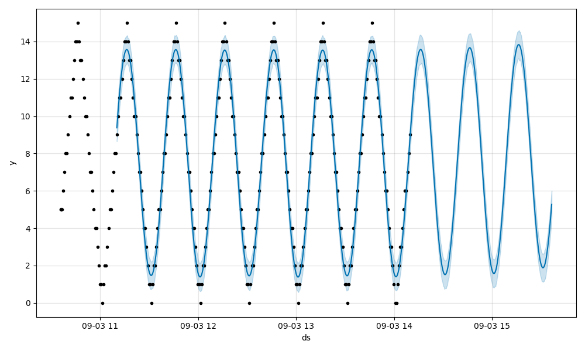

# KEDA Prophet

This projects runs a simple REST API to interface with the Prophet models. It makes it possible to run  multiple Prophet models simultaneously and retrain them on the new data. Internally, it uses SQLite database stored as a file with single table called `metrics`. Each row also contains the name of the metric so that models can be retrained only on their own data.

##  How to Run Locally

###  Set Up Virtual Environment

```bash
python3 -m venv venv
source venv/bin/activate
pip3 install -r requirements.txt
```

## Launch the FastAPI Server

```bash
python3 -m uvicorn app.main:app --reload
```

Navigate to: http://127.0.0.1:8000

### Create model & Insert Sample Data (only for demos)
```bash
# bootstrap model called foo w/ some sample data
curl 'http://127.0.0.1:8000/models/foo/testData'
# bootstrap model called bar w/ some sample data
curl 'http://127.0.0.1:8000/models/bar/testData?days=20&daysTrendFactor=1.2&offHoursFactor=.3&jitter=.1'
```

### Create or Update Model (the proper way)
```bash
# this creates a Prophet model with non-default settings, overriding the `weekly_seasonality` and adding one custom seasonality
hourlyInDays=$(echo "scale=4;1/24" | bc -l | awk '{printf "%.4f\n", $0}')
curl -X POST \
  http://127.0.0.1:8000/models \
  -H "Content-Type: application/json" \
  -d '{
    "name": "foo",
    "weekly_seasonality": "False",
    "custom_seasonality_period": '${hourlyInDays}',
    "custom_seasonality_fourier_order": 3
  }';
```

### Train Models to Fit the Data
```bash
curl http://127.0.0.1:8000/models/foo/retrain
curl http://127.0.0.1:8000/models/bar/retrain
```

### Visualize the Future Prediction as Graph
```bash
open 'http://127.0.0.1:8000/models/foo/graph'
open 'http://127.0.0.1:8000/models/bar/graph'
open 'http://127.0.0.1:8000/models/foo/graph?periods=1000&freq=m'
open 'http://127.0.0.1:8000/models/foo/graph?periods=800&freq=h'

# or open a shipped test model
open http://127.0.0.1:8000/models/test/graph
```

sample output of the last call:
<!-- curl http://127.0.0.1:8000/graph/test -o ./test-graph.png -->


### Insert More Data for a Model
```bash
for i in {0..9}; do
  curl -X POST \
    http://127.0.0.1:8000/models/foo/metrics \
    -H "Content-Type: application/json" \
    -d '{
      "date": "2025-05-01 12:0'${i}':00",
      "value": 6'${i}'0
    }';
done

# retrain
curl http://127.0.0.1:8000/models/foo/retrain
```

### Predict
```bash
curl -s -X POST \
  http://127.0.0.1:8000/models/foo/predict \
  -H "Content-Type: application/json" \
  -d '{
    "start_date": "2025-03-05 12:00:00",
    "periods": 2
  }' | jq
{
  "forecast": [
    {
      "ds": "2025-03-05 12:00:00",
      "yhat": 745.58
    },
    {
      "ds": "2025-03-05 13:00:00",
      "yhat": 827.69
    }
  ]
}
```

### Reset database
```bash
# reset database
curl http://127.0.0.1:8000/resetDb
```

### Delete a Model
```bash
# delete model called foo (removes its data from DB and its serialized Prophet model from fs)
curl -X DELETE http://127.0.0.1:8000/models/foo
```

##  How to Run on Kubernetes

```bash
# this will deploy the k8s manifest from k8s/deployment.yaml (2 PVCs, Deployment and Service)
make deploy-k8s
```

### Container images

```bash
make build-image
make build-image-multiarch
```

## Kubernetes
```bash
k3d cluster create prophet -p "8000:31111@server:0"
helm upgrade -i foo oci://ghcr.io/kedify/charts/keda-prophet --version=v0.0.1 \
   --set service.type=NodePort \
   --set service.nodePort=31111
open http://localhost:8000
# continue with examples in /examples
```

## Dev

### Inspect Database

```bash
sqlite3 data/db.sqlite 'select count(*) from metrics;'
3744
```

```bash
sqlite3 data/db.sqlite
SQLite version 3.43.2 2023-10-10 13:08:14
Enter ".help" for usage hints.
sqlite> SELECT * FROM metrics WHERE name = 'foo';
2025-03-02 00:00:00.000|foo|462.06306463961
..
```

### Inspect DB in k3d
```bash
kubectl debug no/k3d-k3s-default-server-0 -it --image=ubuntu:latest -- bash

ll -h /host/var/lib/rancher/k3s/storage/*_prophet-models/
/host/var/lib/rancher/k3s/storage/pvc-35b34777-4ffd-4a58-adac-5f4a77db5e71_default_prophet-models/:
total 860K
drwxrwxrwx 2 root  root  4.0K Sep  3 10:40 ./
drwx------ 6 root  root  4.0K Sep  3 11:57 ../
-rw-r--r-- 1 65532 65532 354K Aug 28 14:45 prophet-foo.pkl
-rw-r--r-- 1 65532 65532  31K Sep  3 12:59 prophet-minute-metrics-120m.pkl
-rw-r--r-- 1 65532 65532  31K Sep  3 12:59 prophet-minute-metrics-15m.pkl
-rw-r--r-- 1 65532 65532  31K Sep  3 12:59 prophet-minute-metrics-30m.pkl
-rw-r--r-- 1 65532 65532  31K Sep  3 12:59 prophet-minute-metrics-60m.pkl
-rw-r--r-- 1 65532 65532  31K Sep  3 12:59 prophet-minute-metrics-sum-all.pkl
-rw-r--r-- 1 65532 65532  34K Sep  3 13:19 prophet-minute-metrics-sum-some.pkl
-rw-r--r-- 1 65532 65532 299K Sep  2 10:46 prophet-minutemetrics.pkl

ll -h /host/var/lib/rancher/k3s/storage/*_prophet-sqlite/
/host/var/lib/rancher/k3s/storage/pvc-c4eb3c05-32bc-4f03-972c-bb29980e6f20_default_prophet-sqlite/:
total 696K
drwxrwxrwx 2 root  root  4.0K Sep  3 13:42 ./
drwx------ 6 root  root  4.0K Sep  3 11:57 ../
-rw-r--r-- 1 65532 65532 688K Sep  3 13:42 db.sqlite

# make a db snapshot (run outside of debug container)
kubectl cp node-debugger-k3d-k3s-default-server-0-djd59:/host/var/lib/rancher/k3s/storage/pvc-c4eb3c05-32bc-4f03-972c-bb29980e6f20_default_prophet-sqlite/db.sqlite ./db.sqlite_bak
```

## Examples
<!-- curl http://localhost:8000/models/minute-metrics-60m/graph?periods=500&freq=30s&hoursAgo=3 -o ./60m-500p-30s -->
Using data from this [deployment](https://github.com/jkremser/keda-prophet-poc/blob/b08d8b6cd1326530db44649aa73e0e23dd723d70/example/minutemetrics.yaml#L77-L101):


<!-- curl http://localhost:8000/models/minute-metrics-30m/graph?periods=800p&freq=20s -o ./30m-800p-20s -->
Using data from this [deployment](https://github.com/jkremser/keda-prophet-poc/blob/b08d8b6cd1326530db44649aa73e0e23dd723d70/example/minutemetrics.yaml#L39-L63):


<!-- curl http://localhost:8000/models/minute-metrics-sum-all/graph?periods=37&freq=1min -o ./sum-all-37p-1m -->
Using data from obtained by summing all the cycles ([logic here](https://github.com/jkremser/keda-prophet-poc/blob/b08d8b6cd1326530db44649aa73e0e23dd723d70/example/feeder.yaml#L64)):


same data, but later:
<!-- http://localhost:8000/models/minute-metrics-sum-all/graph?periods=400&freq=1min&hoursAgo=4 -o ./sum-all-400p-1m -->


<!-- curl http://localhost:8000/models/minute-metrics-120m/graph?periods=300&freq=10min&hoursAgo=4 -o ./120m-300p-10m -->
Using data from this [deployment](https://github.com/jkremser/keda-prophet-poc/blob/b08d8b6cd1326530db44649aa73e0e23dd723d70/example/minutemetrics.yaml#L115-L139):


> [!IMPORTANT]
> In order to well capture the short-term (less than 24hrs) seasonalities, make sure the model was created with custom `custom_seasonality_period` and `custom_seasonality_fourier_order` params. The first one describes the length of the cycle in days and the second the "resolution" of the regression in terms of fourier orders. High values of `custom_seasonality_fourier_order` can fit more complicated patterns, but can also lead to over-fitting and sacrificing the generalization of the prediction.
